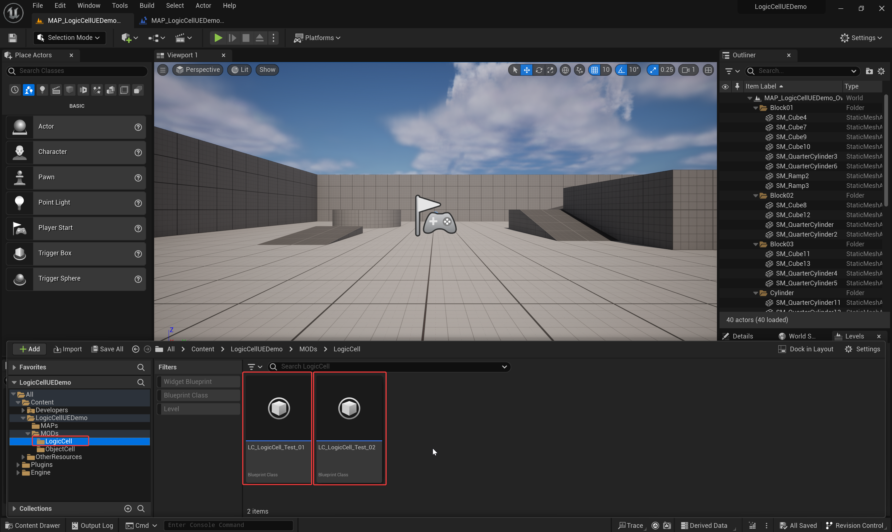
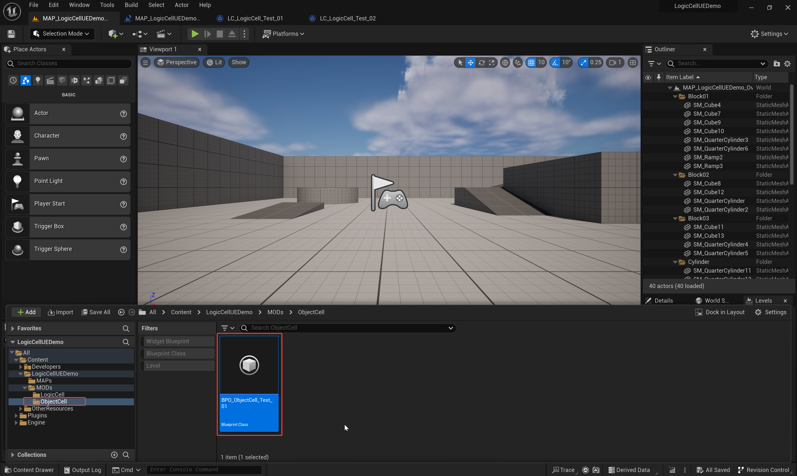

**Note:** There is a bug with the github DownloadZIP(".map" asset file are Git LFS file, Github DownloadZIP results in the ".map" file only 1KB).  **You should clone this repository by HTTPs or SSH of this git, Not by Github DownloadZIP.**

# PRODUCT TITLE：

**LogicCell(Blueprint Logic Encapsulation and Modularization Feature for UE)**

**UE Marketplace:** 

# SHORT DESCRIPTION：

Easily implement Blueprint logic encapsulation and modularization, improving development efficiency and maintainability.

# LONG DESCRIPTION：

**Documentation and Example Project:** https://github.com/YHK-UEPlugins-Public/013_LogicCell_Public

**LogicCell** is a powerful Unreal Engine plugin designed to help Blueprint developers easily encapsulate and modularize their Blueprint logic. By encapsulating Blueprint logic into individual units, you can organize and manage your project more efficiently, while improving code readability and maintainability. The plugin provides convenient Blueprint logic unit call nodes, which can automatically expose input parameters, output delegate events, and their respective parameters from the Blueprint logic unit.

**Features brief**:

- Blueprint Logic Cell
- Logic call node
- Encapsulate  logic
- Automatically exposing
- Improve the efficiency
- Multi-level nested
- Seamless integration 

## Features: 

- **Easily**: encapsulate Blueprint logic into independent units, improving code reusability and project structure clarity
- **Quickly**: create Blueprint logic call nodes, automatically exposing input parameters and output delegate events from the Blueprint logic unit, simplifying the Blueprint logic encapsulation and call process
- **Significantly**: improve the efficiency of Blueprint logic development and modular development
- **Support**: multi-level nested Blueprint logic units, facilitating the organization of complex projects
- **Seamless**: integration into existing Blueprint workflows, no additional learning cost required

**Supported Development Platforms:** Windows, Mac and Linux.

**Supported All Target Build Platforms, such as:** Win64, Mac, iOS, Android, Linux, TVOS, and HoloLens Systems.

**Important/Additional Notes:** 

- It is full-featured and easy to use. 
- No other plugin dependencies required. 
- Written in C++ for optimized performance. 
- Detailed documentation and sample projects to help you get started quickly.
- Professional technical support to solve any issues encountered during use.

# Blueprint nodes overview of "LogicCell" plugin

**Level Blueprint:** '`/LogicCellUEDemo/MAPs/MAP_LogicCellUEDemo_Overview_01`'

**"01":** "**Start LogicCell**" Node

**"02":** "**Create ObjectCell**" Node

**Nested calls are supported:** such as nested calling to LogicCell "**LC_LogicCell_Test_02**" in LogicCell "**LC_LogicCell_Test_01**".

### 01: "Start LogicCell" Node

"**Start LogicCell**" Node will auto create a new LogicCell instance of any specified "ULogicCellBase" subclass(specified by Input parameter "**LogicCellClass**"). And auto call the "**Start**" Function of the new Instance(and will auto trigger the "**OnStart**" event of the LogicCell instance). 

This Node will auto expose the Parameters(the "Instance Editable" and "Expose on Spawn" properties of the Parameters should be **true**). 

And auto expose the **"EventDispatchers"** and their "**Output Parameters**"("**Blueprint Read Only**" property of the "**EventDispatcher**" should be false). 

End it by calling it's "**End LogicCell**" Function. Will end the **LogicCell** Object and destroy it. The **LogicCell** Object will be invalid after end it.

**Note01**: If the blueprint specified by "LogicCellClass" input parameter added a new "Event Dispatcher" or modified the parameters of "Event Dispatcher", should "Compile" the "LogicCellClass" blueprint "**twice**" to get the new modified "Event Dispatcher" shown here("Outputs of this Node"). "

**Note02**: If the "Blueprint Read Only" Property of an "Event Dispatcher" in the blueprint "LogicCellClass" is true, it will not be visible to here("Outputs of this Node")."

**"1":** **"Start LogicCell" Node Title**, contains the name of the class specified by the "**LogicCellClass**" input Parameter. 

**"2":** The "**LogicCellClass**" input Parameter. Should be a subclass of "**ULogicCellBase**"(Blueprint subclass is supported).

**"3":** The Input Parameters of class specified by the "**LogicCellClass**" input Parameter. Those input parameters are auto exposed by setting the "**Instance Editable**" and "**Expose on Spawn**" properties to **true**.

"**LC_LogicCell_Test_01**": '`/LogicCellUEDemo/MODs/LogicCell/LC_LogicCell_Test_01`'

If the  "**Expose on Spawn**" property is **false**, the corresponding parameter will not be exposed to the "**Start LogicCell**" Node.

**"4":** "**NewLogicCell**" output parameter, the new created LogicCell instance of specified "ULogicCellBase" subclass(specified by Input parameter "**LogicCellClass**"). 

**"5":** "**EventDispatcherA**" output Event and output parameters of this Event. 

**"6":** "**EventDispatcher(DownloadImageFinished)**" output Event and output parameters of this Event. The **"EventDispatchers"** and their "**Output Parameters**" are auto exposed("**Blueprint Read Only**" property of the "**EventDispatcher**" should be **false**). 

**Note**: The **"EventDispatcher"** will not be auto exposed if the "**Blueprint Read Only**" property of the "**EventDispatcher**" is **true**. 

**Note**: End it by calling it's "**End LogicCell**" Function. This will auto trigger the "**OnEnd**" event of the LogicCell instance. And will end the **LogicCell** instance object and destroy it. The **LogicCell** Instance Object will be invalid after end it.

### 02: "Create ObjectCell" Node

"**Create ObjectCell**" Node will create a instance of any specified "UObject" subclass(specified by Input parameter "**ObjectClass**").  Should call it's custom \"**Start**\" Function(Should create this function by yourself in your "**ObjectClass**" Blueprint) after this Node. The new created "**ObjectClass**" instance will not be explicitly destroyed and will only be destroyed if its **Outer** is destroyed.

This Node will auto expose the Parameters(the "Instance Editable" and "Expose on Spawn" properties of the Parameters should be **true**). 

And auto expose the **"EventDispatchers"** and their "**Output Parameters**"("**Blueprint Read Only**" property of the "**EventDispatcher**" should be false). 

**Note01**: If the blueprint specified by "ObjectClass"  input parameter added a new "Event Dispatcher" or modified the parameters of "Event Dispatcher", should "Compile" the "ObjectClass" blueprint "**twice**" to get the new modified "Event Dispatcher" shown here("Outputs of this Node"). "

**Note02**: If the "Blueprint Read Only" Property of an "Event Dispatcher" in the blueprint "ObjectClass" is true, it will not be visible to here("Outputs of this Node")."

**"1":** **"Create ObjectCell" Node Title**, contains the name of the class specified by the "**ObjectClass**" input Parameter. 

**"2":** The "**ObjectClass**" input Parameter. Should be a subclass of "**UObject**"(Blueprint subclass is supported).

**"3":** The Input Parameters of class specified by the "**ObjectClass**" input Parameter. Those input parameters are auto exposed by set the "**Instance Editable**" and "**Expose on Spawn**" properties to **true**.

"**BPO_ObjectCell_Test_01**": '`/LogicCellUEDemo/MODs/ObjectCell/BPO_ObjectCell_Test_01`'

If the  "**Expose on Spawn**" property is **false**, the corresponding parameter will not be exposed to the "**Create ObjectCell**" Node.

**"4":** "**NewObjectCell**" output parameter, the new created Object instance of specified "**UObject**" subclass(specified by Input parameter "**ObjectClass**"). 

**"5":** "**EventDispatcher(DownloadImageFinished)**" output Event and output parameters of this Event. The **"EventDispatchers"** and their "**Output Parameters**" are auto exposed("**Blueprint Read Only**" property of the "**EventDispatcher**" should be **false**). 

**Note**: The **"EventDispatcher"** will **not** be auto exposed if the "**Blueprint Read Only**" property of the "**EventDispatcher**" is **true**. 

# Example Introduction

**Map:** '`/LogicCellUEDemo/MAPs/MAP_LogicCellUEDemo_Overview_01`'

Should open **Level Blueprint** of this map:

We tested the "**StartLogicCell**" Node and "**CreateObjectCell**" Node. Choose one of these two methods(Method 1 "**StartLogicCell**" Node or method 2 "**CreateObjectCell**" Node) to implement your logical encapsulation.

**Note**: Click "**Open image in new tab**"(Chrome browser) in right click menu of this image to view **larger image**.

## **Test01**: "**StartLogicCell**"Node

"**LC_LogicCell_Test_01**": '`/LogicCellUEDemo/MODs/LogicCell/LC_LogicCell_Test_01`'

"**LC_LogicCell_Test_02**": '`/LogicCellUEDemo/MODs/LogicCell/LC_LogicCell_Test_02`'

**Note01**: Calling "**StartLogicCell**" Node will auto call the "**Start**" Function of the new Instance(and will auto trigger the "**OnStart**" event of the LogicCell instance). 

**Note02**: End it by calling it's "**End LogicCell**" Function. This will auto trigger the "**OnEnd**" event of the LogicCell instance. And will end the **LogicCell** instance object and destroy it. The **LogicCell** Object will be invalid after end it.

**Nested calls are supported:** such as nested calling to LogicCell "**LC_LogicCell_Test_02**" in LogicCell "**LC_LogicCell_Test_01**".

In this Test01, Called the "DownloadImage" Async Tasks to downalod online images. Nested called the "**LC_LogicCell_Test_02**" in LogicCell "**LC_LogicCell_Test_01**" to test LogicCell nested calling feature.

**Note**: Click "**Open image in new tab**"(Chrome browser) in right click menu of this image to view **larger image**.

## **Test02**: "**CreateObjectCell**"Node

"**BPO_ObjectCell_Test_01**": '`/LogicCellUEDemo/MODs/ObjectCell/BPO_ObjectCell_Test_01`'

In this Test02, Called the "DownloadImage" Async Task to downalod online image. For testing the feature: Any subclass of "**UObject**" can be used as a logically encapsulated class.

**Note**: Click "**Open image in new tab**"(Chrome browser) in right click menu of this image to view **larger image**.

## Results of example:

